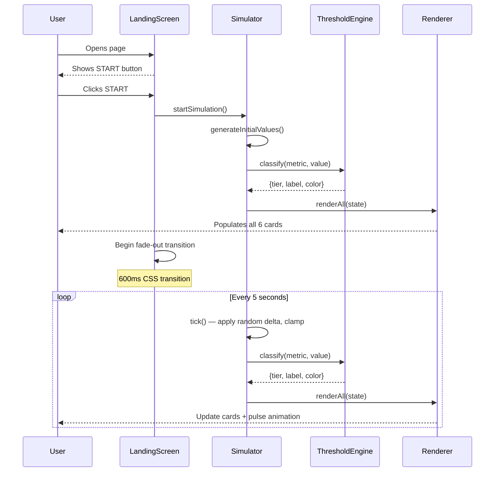

# Design Document: Air Quality Dashboard

## Overview

The Air Quality Dashboard is a self-contained, single-file web application that simulates and displays six indoor air quality metrics in real time. It requires no build tools, no server, and no external dependencies beyond a Google Fonts stylesheet — it opens directly in any modern browser.

The application has two distinct phases:

1. **Landing Screen** — a full-screen welcome view with a centered "START" button. No simulation runs here.
2. **Monitoring View** — the live dashboard, revealed after the user clicks START. The simulator begins immediately on click, populating all six metric cards before the transition completes.

### Aesthetic Direction

The design commits to a **dark industrial / scientific instrument** aesthetic — think mission control, not a consumer wellness app. The palette is deep charcoal with near-white text, sharp cyan accents, and status colors that read as data signals rather than traffic lights. Typography pairs **Space Grotesk** (headings, labels, metric names) with **JetBrains Mono** (numeric values, timestamps) — both available on Google Fonts. This combination gives the dashboard a technical, authoritative character that is immediately distinctive and avoids all generic AI-aesthetic patterns.

**Color palette:**
- Background: `#0f1117` (deep charcoal)
- Card surface: `#1a1d27` (slightly lighter charcoal)
- Card border: `#2a2d3a` (subtle separator)
- Primary text: `#e8eaf0` (near-white, contrast ≥ 12:1 on card surface)
- Secondary text / labels: `#8b90a0` (muted, contrast ≥ 4.6:1 on card surface)
- Accent / active: `#00d4ff` (cyan, used for START button and active indicators)
- Status Good: `#22c55e` (green)
- Status Moderate: `#f59e0b` (amber)
- Status Unhealthy: `#f04848` (red, contrast ≥ 4.58:1 on card surface)

All text/background pairs meet WCAG 2.1 AA (≥ 4.5:1 contrast ratio).

---

## Architecture

The application is a single HTML file with three embedded logical sections: CSS styles, HTML structure, and JavaScript. There are no modules, no bundlers, and no runtime dependencies. The JavaScript is organized into four clearly separated sections with comment-block headers:

```
index.html
├── <style>          — All CSS: design tokens, layout, components, animations
├── <body>
│   ├── #landing     — Landing screen (full-viewport, hidden after START)
│   └── #dashboard   — Monitoring view (hidden initially, revealed after START)
└── <script>
    ├── CONFIG       — Constants: metric definitions, thresholds, update interval
    ├── SIMULATOR    — Data generation: initial values, tick logic, clamping
    ├── THRESHOLD ENGINE — Classification: value → {tier, color, label}
    └── RENDERER     — DOM updates: card rendering, timestamp, animations
```

### Data Flow



### State Model

The application holds a single mutable state object:

```javascript
const state = {
  metrics: {
    co2:   { value: Number, tier: String, label: String, color: String },
    co:    { value: Number, tier: String, label: String, color: String },
    pm25:  { value: Number, tier: String, label: String, color: String },
    pm10:  { value: Number, tier: String, label: String, color: String },
    hcho:  { value: Number, tier: String, label: String, color: String },
    tvoc:  { value: Number, tier: String, label: String, color: String },
  },
  lastUpdated: Date,
  running: Boolean,
}
```

---

## Components and Interfaces

### CONFIG

A static object containing all metric definitions and the update interval. Centralizing this makes thresholds and ranges easy to audit and modify.

```javascript
const CONFIG = {
  UPDATE_INTERVAL: 5000, // ms

  metrics: {
    co2: {
      name: 'Carbon Dioxide',
      unit: 'ppm',
      precision: 0,          // whole number
      min: 400, max: 5000,
      baseline: { min: 400, max: 800 },
      delta: 50,             // max random delta per tick
      thresholds: { good: 1000, moderate: 2000 },
    },
    co: {
      name: 'Carbon Monoxide',
      unit: 'ppm',
      precision: 0,
      min: 0, max: 100,
      baseline: { min: 0, max: 5 },
      delta: 2,
      thresholds: { good: 9, moderate: 35 },
    },
    pm25: {
      name: 'Fine Particulate Matter',
      unit: 'µg/m³',
      precision: 1,          // one decimal place
      min: 0, max: 150,
      baseline: { min: 0, max: 10 },
      delta: 3,
      thresholds: { good: 12.0, moderate: 35.4 },
    },
    pm10: {
      name: 'Coarse Particulate Matter',
      unit: 'µg/m³',
      precision: 1,
      min: 0, max: 300,
      baseline: { min: 0, max: 40 },
      delta: 5,
      thresholds: { good: 54, moderate: 154 },
    },
    hcho: {
      name: 'Formaldehyde',
      unit: 'mg/m³',
      precision: 2,          // two decimal places
      min: 0, max: 0.5,
      baseline: { min: 0, max: 0.05 },
      delta: 0.01,
      thresholds: { good: 0.08, moderate: 0.16 },
    },
    tvoc: {
      name: 'Total VOCs',
      unit: 'ppb',
      precision: 0,
      min: 0, max: 2000,
      baseline: { min: 0, max: 150 },
      delta: 30,
      thresholds: { good: 220, moderate: 660 },
    },
  },
};
```

### Simulator

Responsible for generating and updating metric values. Exposes two functions:

```javascript
// Generate initial values within baseline ranges for all metrics
function generateInitialValues(): SimulatorState

// Advance all metrics by one tick: apply random delta, clamp to [min, max]
function tick(currentState: SimulatorState): SimulatorState
```

**Tick logic:**
```
newValue = currentValue + (Math.random() * 2 - 1) * delta
newValue = Math.max(metric.min, Math.min(metric.max, newValue))
```

The delta is symmetric (±delta), producing a random walk. Clamping ensures values never escape the defined bounds.

### ThresholdEngine

A pure function that maps a metric key and numeric value to a classification object:

```javascript
// Returns { tier: 'good'|'moderate'|'unhealthy', label: String, color: String }
function classify(metricKey: string, value: number): Classification
```

Classification logic (same pattern for all metrics, using CONFIG thresholds):
```
if value <= thresholds.good   → { tier: 'good',      label: 'Good',      color: '#22c55e' }
if value <= thresholds.moderate → { tier: 'moderate', label: 'Moderate',  color: '#f59e0b' }
else                           → { tier: 'unhealthy', label: 'Unhealthy', color: '#f04848' }
```

### Renderer

Handles all DOM mutations. Reads from state and updates the DOM; never modifies state.

```javascript
// Update all 6 metric cards and the timestamp
function renderAll(state: SimulatorState): void

// Update a single metric card (called by renderAll)
function renderCard(metricKey: string, metricState: MetricState): void

// Format a numeric value to the correct precision for a metric
function formatValue(metricKey: string, value: number): string

// Format a Date to "Last updated: HH:MM:SS"
function formatTimestamp(date: Date): string
```

**Pulse animation:** After each tick, `renderCard` adds a CSS class `card--pulse` to the card element. The class is removed after 600 ms via `setTimeout`. The CSS `@keyframes pulse` animation runs for exactly 600 ms.

### Landing Screen Controller

```javascript
// Called once when START is clicked
function startDashboard(): void
  // 1. Call generateInitialValues() and classify all metrics
  // 2. Call renderAll() to populate cards before transition
  // 3. Add CSS class 'is-transitioning' to trigger fade animation
  // 4. After 600ms, hide landing screen, show dashboard
  // 5. Start setInterval(tick, CONFIG.UPDATE_INTERVAL)
```

---

## Data Models

### MetricConfig (per metric in CONFIG)

| Field | Type | Description |
|---|---|---|
| `name` | string | Full display name |
| `unit` | string | Unit of measurement |
| `precision` | number | Decimal places for display |
| `min` | number | Absolute minimum (clamp floor) |
| `max` | number | Absolute maximum (clamp ceiling) |
| `baseline.min` | number | Initial value range lower bound |
| `baseline.max` | number | Initial value range upper bound |
| `delta` | number | Maximum random change per tick |
| `thresholds.good` | number | Upper bound for Good tier |
| `thresholds.moderate` | number | Upper bound for Moderate tier |

### MetricState (runtime, per metric)

| Field | Type | Description |
|---|---|---|
| `value` | number | Current simulated reading |
| `tier` | string | `'good'` \| `'moderate'` \| `'unhealthy'` |
| `label` | string | `'Good'` \| `'Moderate'` \| `'Unhealthy'` |
| `color` | string | Hex color string for the status indicator |

### SimulatorState (full application state)

| Field | Type | Description |
|---|---|---|
| `metrics` | Record\<string, MetricState\> | State for all 6 metrics |
| `lastUpdated` | Date | Timestamp of most recent tick |
| `running` | boolean | Whether the simulation is active |

### Classification (ThresholdEngine output)

| Field | Type | Description |
|---|---|---|
| `tier` | string | `'good'` \| `'moderate'` \| `'unhealthy'` |
| `label` | string | Human-readable status label |
| `color` | string | Hex color for Color_Indicator |

---

## Correctness Properties

*A property is a characteristic or behavior that should hold true across all valid executions of a system — essentially, a formal statement about what the system should do. Properties serve as the bridge between human-readable specifications and machine-verifiable correctness guarantees.*

### Property Reflection

Before writing properties, I reviewed the prework analysis for redundancy:

- **1.4 and 1.5** (clamp to min / clamp to max) are both edge cases of **1.2** (values stay within bounds). They are subsumed by Property 1 below, which covers the full range including boundaries.
- **3.2** (color matches tier) is directly implied by **3.1** (exactly one tier assigned). A single property that verifies both tier and color together covers both criteria without redundancy.
- **3.3–3.8** (per-metric thresholds) are all instances of the same universal threshold-correctness property. They are consolidated into Property 3, which covers all six metrics.
- **2.3** (card displays all required fields) and **2.4** (correct numeric precision) are related but test different aspects of the rendering function — they remain separate properties.
- **5.1** (contrast ratio) is a universal property over all color pairs in the design system — kept as Property 6.

After reflection, six distinct properties remain.

---

### Property 1: Simulator values always stay within defined bounds

*For any* metric and any sequence of simulator ticks starting from any valid initial value, every produced value SHALL be within the `[min, max]` range defined for that metric in CONFIG — including after applying a delta that would otherwise exceed the boundary (clamping behavior).

**Validates: Requirements 1.1, 1.2, 1.4, 1.5**

---

### Property 2: Metric card renders all required fields

*For any* metric key and any valid metric state (value within bounds, tier assigned), the rendered Metric_Card HTML SHALL contain the metric's full name, its unit of measurement, the formatted numeric value, the Status_Label text, and a Color_Indicator element with the correct status color.

**Validates: Requirements 2.3**

---

### Property 3: Numeric values are formatted to the correct precision

*For any* metric key and any numeric value within that metric's valid range, `formatValue(metricKey, value)` SHALL return a string representation rounded to the precision specified for that metric: 0 decimal places for CO2, CO, TVOC; 1 decimal place for PM2.5, PM10; 2 decimal places for HCHO.

**Validates: Requirements 2.4**

---

### Property 4: Threshold classification is total and correct

*For any* metric key and any numeric value within that metric's `[min, max]` range, `classify(metricKey, value)` SHALL return exactly one of `{good, moderate, unhealthy}` as the tier, and the returned color SHALL be the correct hex value for that tier (`#22c55e`, `#f59e0b`, or `#f04848` respectively). The classification SHALL respect the threshold boundaries defined in Requirements 3.3–3.8.

**Validates: Requirements 3.1, 3.2, 3.3, 3.4, 3.5, 3.6, 3.7, 3.8**

---

### Property 5: Timestamp format is always valid

*For any* `Date` object, `formatTimestamp(date)` SHALL return a string that matches the pattern `"Last updated: HH:MM:SS"` where HH, MM, and SS are zero-padded two-digit numbers representing hours (00–23), minutes (00–59), and seconds (00–59).

**Validates: Requirements 2.5**

---

### Property 6: All text/background color pairs meet WCAG 2.1 AA contrast

*For any* text/background color pair defined in the dashboard's design system (primary text on card surface, secondary text on card surface, status labels on card surface, accent text on background, START button text on button background), the computed contrast ratio SHALL be at least 4.5:1.

**Validates: Requirements 5.1, 7.7**

---

## Error Handling

Since this is a client-side simulation with no external I/O, the error surface is narrow. The following cases are handled defensively:

### Unknown metric key
If `classify()` or `formatValue()` receives an unrecognized metric key, they log a console warning and return a safe default (`{ tier: 'good', label: 'Good', color: '#22c55e' }` and `'0'` respectively). This prevents a bad key from crashing the render loop.

### Value out of range
The simulator's `tick()` function always clamps output to `[min, max]`. If somehow a value outside this range reaches `classify()`, the threshold comparisons still produce a valid tier (values below `good` threshold → Good; values above `moderate` threshold → Unhealthy). No crash occurs.

### setInterval not supported
The `startDashboard()` function checks for `typeof setInterval === 'function'` before starting the simulation loop. If unavailable (extremely rare), it runs a single tick and displays a static reading with a note that live updates are unavailable.

### CSS animations not supported
The pulse animation is applied via a CSS class. If the browser does not support `@keyframes`, the class has no visual effect but causes no errors. The `prefers-reduced-motion` media query is respected: when set, the pulse animation and the landing-to-dashboard transition are disabled, satisfying WCAG 2.1 AA motion requirements.

---

## Testing Strategy

### PBT Applicability Assessment

This feature is well-suited for property-based testing in its pure logic layers:
- **ThresholdEngine** (`classify`) is a pure function with a large input space (continuous numeric ranges for 6 metrics).
- **Simulator** (`tick`, `generateInitialValues`) has clear invariants (values stay in bounds).
- **Renderer** formatting functions (`formatValue`, `formatTimestamp`) are pure functions with universal correctness properties.

PBT is **not** applied to:
- CSS layout and responsive breakpoints (use example-based browser tests)
- DOM rendering and animation timing (use example-based tests with a DOM environment)
- The landing screen interaction flow (use example-based integration tests)

### Property-Based Testing

**Library:** [fast-check](https://github.com/dubzzz/fast-check) (JavaScript, no build tools required — can be loaded via CDN in a test HTML file, or via npm for a Node.js test runner).

**Configuration:** Minimum 100 iterations per property test (`numRuns: 100`).

**Tag format:** Each test is tagged with a comment: `// Feature: air-quality-dashboard, Property N: <property_text>`

| Property | Test Description | Arbitraries Used |
|---|---|---|
| Property 1 | Simulator values stay within bounds | `fc.constantFrom(...metricKeys)`, `fc.float()` for delta |
| Property 2 | Card renders all required fields | `fc.constantFrom(...metricKeys)`, `fc.float({min, max})` per metric |
| Property 3 | Numeric precision is correct | `fc.constantFrom(...metricKeys)`, `fc.float({min, max})` per metric |
| Property 4 | Threshold classification is total and correct | `fc.constantFrom(...metricKeys)`, `fc.float({min, max})` per metric |
| Property 5 | Timestamp format is always valid | `fc.date()` |
| Property 6 | Color contrast meets WCAG AA | Static enumeration of all design-system color pairs |

### Unit / Example-Based Tests

Focused on specific behaviors not covered by properties:

- **Simulator tick updates all 6 metrics simultaneously** (Req 1.3)
- **UPDATE_INTERVAL constant equals 5000** (Req 1.6)
- **Dashboard renders exactly 6 Metric_Cards** (Req 2.1)
- **Card updates within 500ms of a tick** (Req 2.2, 3.9) — requires a DOM test environment (jsdom or browser)
- **Responsive layout breakpoints** (Req 4.1–4.3) — requires a browser or headless browser
- **No horizontal overflow at 320px–2560px** (Req 4.4) — requires a browser
- **Font sizes meet minimums** (Req 4.5) — inspect computed styles
- **Font family is not Inter or Roboto** (Req 5.2) — inspect CSS
- **Transition duration ≤ 300ms** (Req 5.3) — inspect CSS
- **Pulse animation duration = 600ms** (Req 5.4) — inspect CSS
- **Cards have visible separation** (Req 5.5) — inspect computed styles
- **Landing screen visible on load, Monitoring_View hidden** (Req 7.1)
- **START button labeled "START", centered** (Req 7.2)
- **App title present on landing screen** (Req 7.3)
- **Clicking START hides landing, shows dashboard** (Req 7.4)
- **Clicking START populates all 6 cards** (Req 7.5)
- **Transition completes within 600ms** (Req 7.6)
- **START button touch target ≥ 48×48px** (Req 7.7)

### Accessibility Testing

- Automated: axe-core or similar tool run against the rendered HTML
- Manual: keyboard navigation (Tab to START button, Enter to activate), screen reader smoke test (VoiceOver / NVDA)
- `prefers-reduced-motion` behavior verified manually
